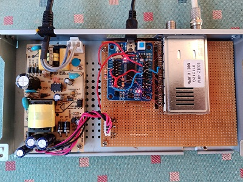

# Linux DVB-S2 NIM Sat-Tuner  CX24116

**What is this ?** 
 
Its a hardware and software project, building a **satellite tuner** to be used with **Linux DVB**.  

Something like the ***MiniTiouner***.   
  
  

## Overview
This Satellite Receiver connects to a linux computer via USB cable.  
It will be detected by linux-kernel as a "DVBWorld DW2104 USB2.0" DVB-Tuner-device.
Its basicly a clone.  
  
Components used: 
- **Sharp BSBE2-401A NIM Tuner** (CX24116/8) from ALI for about 7 $. (from 2008, used fe. in dreambox) 
- **CY7C68013A FX2LP LCsoft-Board** USB controller from ALI for about 3 $ 
- salvaged **old SatReceiver case** with powersupply for free. 
- some **additional circuitry** for powersupply and LNB supply. 
- **connection via USB**
 
Software: 
- **firmware** for the LCsoft USB board and the CX24116/8 demodulator/tuner. 

## Linux DVB API 
 
The Linux DVB framework dates back to around 2009 with not much improvement ever since.  
At that time a couble of Sat-Tuners came on the market and Linux implemented support for them.  
 
Using the Linux DVB framework has the advantage that you do not need to write one line of code.  
Its all there. Use Kaffeine, TvHeadEnd or VLC to watch television.  
 
I was especially looking for a Tuner whos chipset was supported by the Linux Kernel.  
Eh Viola inexpensive Sharp Tuner turned up having the CX24116/8 chipset.  
 
It is a **NIM(Network Interface Module) Tuner**, meaning it has a Tuner(cx24118) and a Demodulator Chip(cx24116) in it.   
So it outputs the MPEG TS stream from the tuned transponder.  
 
Now i had to look into the list of supported devices for Linux DVB-S2 USB:  
- "DVBWorld DW2104 USB2.0" 
- exactly the DVBWorld2104C model. 
 
Ok, now i had to design my circuit such that the resulting device immitates a "DVBWorld DW2104 USB2.0" product,  
so the Kernel will accepts it. 
 
The Linux kernel needs two firmware files for this SatReceiver:  
- **dvb-fe-cx24116.fw**   =  code for the **cx24116 internal processor** to do automated tuning etc. 
- **dvb-usb-dw2104.fw**   =  code for the **fx2lp Cypress chip** USB interface to support streaming and i2c transfer to/from cx24116. 
 
These two files reside in Linux under **/lib/firmware** and are downloaded on USB connect by the kernel.  
 
## The Circuit 
 
general function blocks:  
 
DISH--LNB--COAX-CABLE--**[NIM-TUNER--USB-INTERFACE]**--USB-CABLE--LINUX-MACHINE  
 
The original DVBWORLD device also uses the Cypress FX2LP Chip, so the LCsoft-board will do the USB interface job.  
 
The original firmware "dvb-usb-dw2104.fw" cannot be used, as my HW-design is different.  
(at least i could not find a schematic for the DVBWORLD device.)
 
So the only software that needs to be developed was the one for the FX2LP Chip, replacing the "dvb-usb-dw2104.fw".  
 
All i2c-control transfer is done via USB Endpoint 0 and it is very important to get this right,   
otherwise you wonder why things not working.  
 
There is a pdf with the **schematic**.  

## Powersupply for the Tuner and LNB
The salvaged receiver case provided already a switching power supply with 5V and 23V, how handy ;)  
 
The cx24116 is taking 1.2V and approx. 500mA. from 5V  
The LNB needs 13 or 18V at around 100mA. from 23V  
For the 3.3V i took a standard LM1117 LDO regulator. from 5V.  
 
For the 1.2V i took an SPS i had available, but also a LM317 can be used as 1.2V is the minimum voltage it can deliver.  
For the LNB the LM317 is ideal as the voltage switching is easy to implement.  
LM317 need heatsink.  
As for the FX2LP LCsoft-board, i disconnected the USB-side 5V supply and hooked the board up to the internal 5V supply.  
(may not be necessary)

## Software

- copy "dvb-usb-dw2104.fw" and "dvb-fe-cx24116.fw"  to /lib/firmware in Linux.
- flash the "fx2lp.hex" file once to the LCsoft-board eeprom.  (using the CyControl.exe in tools)

The firmware "dvb-usb-dw2104.fw" features the two onboard Leds to indicate:
- Led1 : blinking = streaming is on; 	constantly on = no data from tuner, constantly off = host not reading
- Led2 : on = Host not reading USB stream fast enough, ie. change channels;     off = all ok.

Due to many requests, I have now included the "dvb-usb-dw2104.fw" firmware **sourcecode**.

Thats it .  

## Ideas
I was reading about the MiniTiouner project on amsat-dl.org forum, hmm, maybe there is a usecase for this too,   
for the amateur TV hobbyist.  
Might require to write a special kernel-driver which has the benefit of speed and Demux-filters readily available.  
Also might need a special firmware written for the cx24116 instead of the standard "dvb-fe-cx24116.fw".  

 
 What a HackaDay ;)  
 
have fun, xenpac;)  

